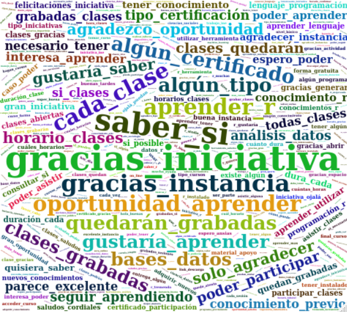
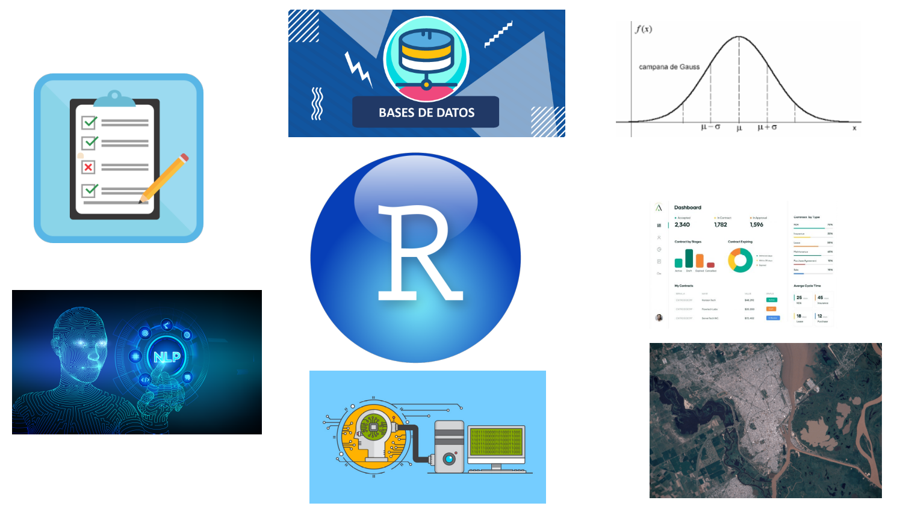
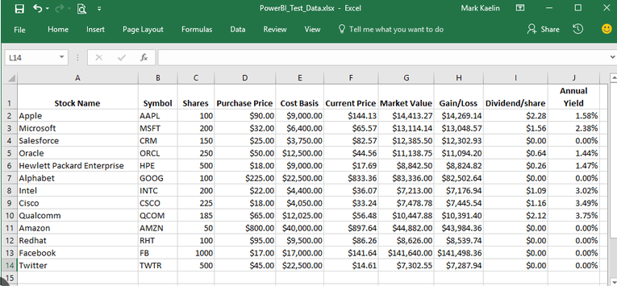
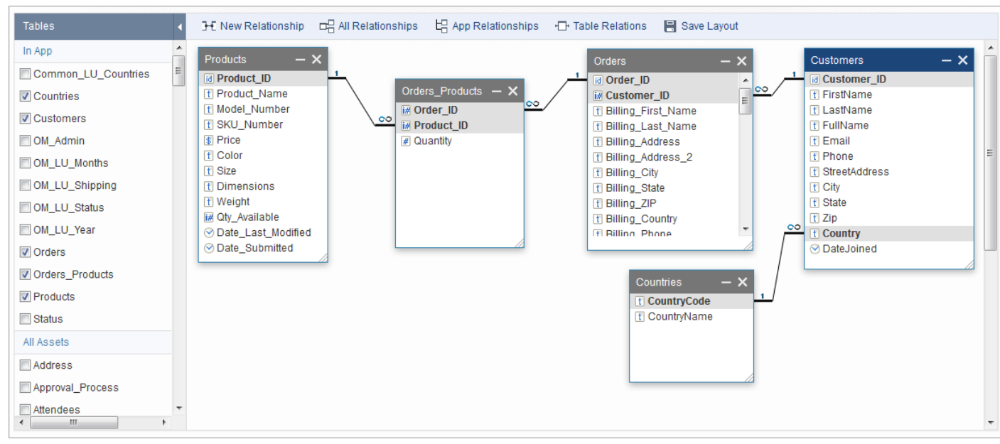
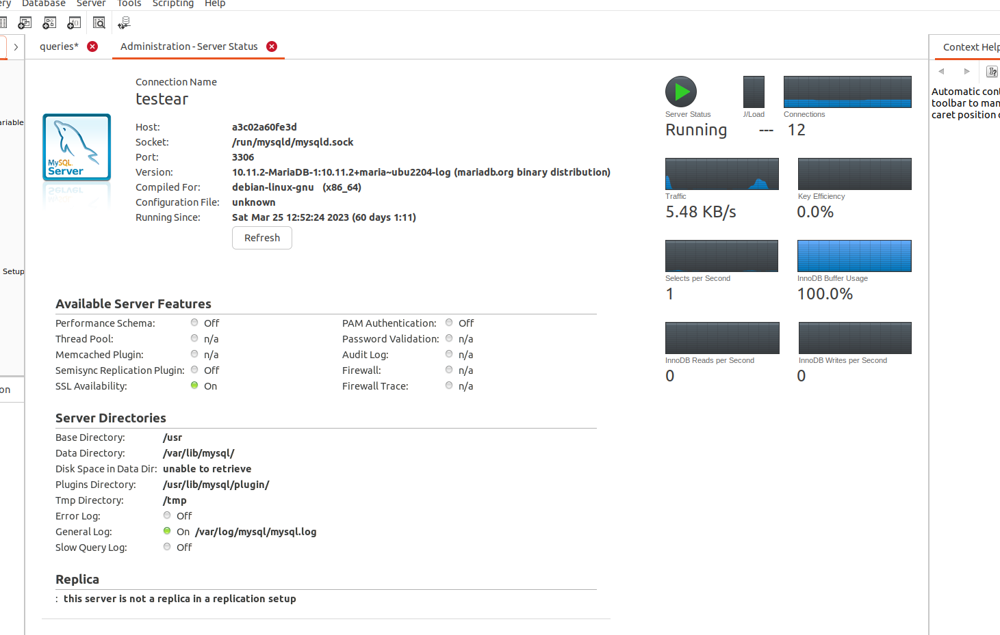

class: center, middle

.linea-superior[]
.linea-inferior[]


## INE Educa: Clases abiertas de R

## Proyecto Ciencia de Datos

### Mayo 2023

```{r setup, include=FALSE}
options(htmltools.dir.version = TRUE)
knitr::opts_chunk$set(message = FALSE, warning = F, eval = T) 
options(scipen = "999")
```

```{r xaringan-themer, include=FALSE, warning=FALSE}
library(xaringanthemer)
```


---

background-image: url("imagenes/fondo2.PNG")
background-size: contain;
background-position: 100% 0%


# Gracias por el interés

```{r, echo=FALSE}
library(wordcloud2)
library(quanteda)
library(readxl)
library(quanteda.textstats)
library(quanteda.textplots)
library(dplyr)

comments = read_excel("data/comentarios.xlsx")
names(comments) = "text"

words <- corpus(comments) %>% 
  tokens(remove_punct = TRUE, remove_numbers = TRUE) %>% 
  tokens_select(pattern = stopwords("es"), selection = "remove") %>% 
  tokens_ngrams(2) %>% 
  dfm() %>% 
  textstat_frequency(n = 1000) %>% 
  rename(word = feature,
         freq = frequency)


wc <- wordcloud2(words, size=1.1, color='random-dark')


```


.center[





]


---

background-image: url("imagenes/fondo2.PNG")
background-size: contain;
background-position: 100% 0%


# Motivación de la actividad


.center[





]

--


.center[

### Esta presentación también está hecha con `R` 
]

---

background-image: url("imagenes/fondo2.PNG")
background-size: contain;
background-position: 100% 0%


# Comentario preliminar


.center[


### Público objetivo: Usuarios y usuarias intermedios de R

]

--

**Objetivo del taller:**

- Mostrar a los y las participantes cómo interactuar con una base de datos desde R 


---

class: inverse, center, middle

# I. Introducción 

---
background-image: url("imagenes/fondo2.PNG")
background-size: contain;
background-position: 100% 0%

# ¿Por qué es relevante trabajar con BBDD?

### Muchos datos viven en lugares diferentes a nuestros computadores 

.center[


]

--

### Como analistas, debemos ser capaces de trabajar con esos datos

--

### Las aplicaciones en general utilizan bases de datos

`Shiny` no es la excepción (*sesión 2*)

---

background-image: url("imagenes/fondo2.PNG")
background-size: contain;
background-position: 100% 0%

# ¿Qué es una base de datos?


.center[


]


--

### Nos centraremos en el mundo SQL (bases de datos relacionales)

--

Si quieres saber más sobre el mundo NoSql, puedes partir por [wikipedia](https://es.wikipedia.org/wiki/NoSQL) 

--

**¡Advertencia!: Esta no es una clase sobre bases de datos**


---


background-image: url("imagenes/fondo2.PNG")
background-size: contain;
background-position: 100% 0%

# ¿Qué es una base de datos relacional?

Colección de tablas relacionadas por un campo común (key)

--

Archivos csv, dta (Stata) o sav (SPSS) **NO** son bases de datos relacionales  

--

Coloquialmente, usamos el concepto "base de datos" para referirnos a esto     

--

.center[





]


---
background-image: url("imagenes/fondo2.PNG")
background-size: contain;
background-position: 100% 0%

# ¿Cómo se ve una base de datos?

.center[





]


---


background-image: url("imagenes/fondo2.PNG")
background-size: contain;
background-position: 100% 0%

# ¿Qué es una base de datos relacional?

**Aclaremos un poco más**

--


**Las tablas se parecen a los dataframes**

- Colecciones de columnas

- Las columnas contienen datos del mismo tipo

--

**Diferencias**

- Las tablas no viven en memoria

- Los *dataframe* no tienen índices (*data.table* sí tiene)


---


background-image: url("imagenes/fondo2.PNG")
background-size: contain;
background-position: 100% 0%

# Gestores populares de bases de datos 


.center[


]

### Tienen diferencias, pero todas utilizan SQL

### [Aquí](https://en.wikipedia.org/wiki/List_of_relational_database_management_systems) puedes encontrar aún más gestores de bases de datos


--

<br>

.center[

### Mucho blabla ¡Veamos un poco de código!
]


---


class: inverse, center, middle

# II. Conexión a una base de datos 


---


background-image: url("imagenes/fondo2.PNG")
background-size: contain;
background-position: 100% 0%

# Conexión a una base de datos

Vamos a conectarnos a una base que contiene datos de la Encuesta Nacional de Empleo (ENE) para varios trimestres

```{r}
library(DBI)
library(dplyr)
```

```{r, eval=FALSE}
conn <-  DBI::dbConnect(
  drv =  RMariaDB::MariaDB(),
  dbname = "ine", # nombre de la base de datos
  host =   "143.198.79.143" , # IP del servidor
  port =   1111, # puerto
  password = "XXXXXXXXXX", #  pass
  user = "reader" #  solo permiso de lectura
)

```
```{r, eval=TRUE, echo=FALSE}
conn <-  DBI::dbConnect(
  drv =  RMariaDB::MariaDB(),
  dbname = "ine", # nombre de la base de datos
  host =   "143.198.79.143" , # IP del servidor
  port =   1111, # puerto
  password = Sys.getenv("pass"), #  pass
  user = "reader" #  solo permiso de lectura
)

```

.center[


]


---

background-image: url("imagenes/fondo2.PNG")
background-size: contain;
background-position: 100% 0%

# Conexión a una base de datos

.center[


]

### El parámetro driver corresponde al gestor de base de datos que estamos usando

---

background-image: url("imagenes/fondo2.PNG")
background-size: contain;
background-position: 100% 0%

# Consultas simples con DBI

Listemos las tablas dentro de la base de datos

```{r}
DBI::dbListTables(conn)
```

--

Veamos el nombre de las columnas dentro de ene

```{r}
columns <- DBI::dbListFields(conn, "ene")
columns
```

--

Podemos leer la tabla completa, sin embargo, no siempre es buena idea

```{r, eval=FALSE}
table_ene <-  DBI::dbReadTable(conn, "ene")
```

--

### La tabla puede ser demasiado grande y no entrar en la memoria


---

background-image: url("imagenes/fondo2.PNG")
background-size: contain;
background-position: 100% 0%

# Consultas simples con SQL

Contemos el número de filas que tiene la tabla

```{r}
sql_output_df <- dbGetQuery(conn, "SELECT COUNT(*) AS `contar` FROM `ene`")
sql_output_df
```


Podemos ver que la tabla contiene `r as.character(sql_output_df$contar[1])`

No es tan buena idea pedir la tabla completa

--

Noten que `dbGetQuery` devuelve un *dataframe* con el resultado de la consulta 👀


---
background-image: url("imagenes/fondo2.PNG")
background-size: contain;
background-position: 100% 0%

# Consultas por lotes

`dbSendQuery` envía la consulta sin hacer *fetch* (traer)

.small[

```{r}
sql_query <- dbSendQuery(conn, "SELECT COUNT(*) AS `contar` FROM `ene`")
sql_query
```
]

--

Podemos hacer consultas por "lotes"

.small[
```{r}
sql_query <- dbSendQuery(conn, "SELECT sexo, edad FROM `ene`")
output1 <- dbFetch(sql_query, 10) 
DBI::dbHasCompleted(sql_query) 
output2 <- dbFetch(sql_query, 10) 
DBI::dbHasCompleted(sql_query) 
output3 <- dbFetch(sql_query, 94023) 
DBI::dbHasCompleted(sql_query) 

```

]
---
background-image: url("imagenes/fondo2.PNG")
background-size: contain;
background-position: 100% 0%

# Consultas por lotes

```{r}
sql_query <- dbSendQuery(conn, "SELECT sexo, edad FROM `ene`")
```


```{r}
count <- 0
# Mientras queden filas por extraer...
while (DBI::dbHasCompleted(sql_query) == FALSE ) {
  # Traer las 20.000 filas siguientes
  output <- dbFetch(sql_query, 20000) 
  count <- count + 1
  print(count)
}

```
Con esta estrategia podemos procesar información de manera fragmentada, incluso en una máquina pequeña 😎 

--

.center[
### ¿Es imprescindible aprender SQL para trabajar con una base de datos?
]


---
background-image: url("imagenes/fondo2.PNG")
background-size: contain;
background-position: 100% 0%

# dplyr al rescate

.pull-left[

]


.pull-right[

```{r}
library(dplyr)
connection <- tbl(conn, "ene")

connection %>% 
  summarise(freq = n()) 
```

]

--

Con `show_query` podemos ver la traducción a SQL

```{r}
connection %>% 
  summarise(freq = n()) %>% 
  show_query()

```

---

background-image: url("imagenes/fondo2.PNG")
background-size: contain;
background-position: 100% 0%

# Funcionamiento dbplyr 

.pull-left[

```{r}
library(tictoc)
tic()
output <-  connection %>% 
  filter(edad <= 25) %>% 
  group_by(sexo) %>% 
  summarise(freq = n()) 
toc()
```

]

.pull-right[

```{r}

tic()
connection %>% 
  filter(edad <= 25) %>% 
  group_by(sexo) %>% 
  summarise(freq = n()) 
toc()


```

]

--

### ¿Por qué el tiempo de ejecución es tan distinto?

--

.center[

]


---

background-image: url("imagenes/fondo2.PNG")
background-size: contain;
background-position: 100% 0%

# Evaluación lazy 

La consulta funciona por detrás con `dbplyr` 

`dbplyr` intenta retrasar la evaluación lo que más pueda 

--

El objeto `output` no es un `dataframe`, sino una conexión a la base de datos

```{r}
class(output)
```

--

Con `collect` podemos traer la información desde la base de datos 

```{r}
output %>%
  collect() %>% 
  class()
```

--

### Recuerda que la consulta se ejecuta en el servidor

El resultado de la consulta no necesariamente entrará en tu memoria


---
background-image: url("imagenes/fondo2.PNG")
background-size: contain;
background-position: 100% 0%

# Ejercicio 

Queremos calcular la cantidad de ocupados para cada una de las regiones del país usando el factor de expansión.  


```{r}
dbListFields(conn, "ene")

ene_data <-  tbl(conn, "ene")

df <- ene_data %>% 
  filter(activ == 1) %>% 
  group_by(region) %>% 
  summarize(total = sum(fact_cal) ) %>% 
  collect()
```


---
background-image: url("imagenes/fondo2.PNG")
background-size: contain;
background-position: 100% 0%

# Demostración 

Para ver la consulta en SQL, usamos `show_query`

```{r}
ene_data %>% 
  filter(activ == 1) %>% 
  group_by(region) %>% 
  summarize(total = sum(fact_cal) ) %>% 
  show_query()
```
--

### Podemos ir aprendiendo SQL de manera pausada

---
background-image: url("imagenes/fondo2.PNG")
background-size: contain;
background-position: 100% 0%

# Resumiendo... 

Hasta el momento hemos consultado una base de datos

--

Estamos usando un usuario que solo tiene permisos de lectura

```{r, error=TRUE}
df <- data.frame(var1 = c(1:3), var2 = 4:6)
DBI::dbCreateTable(conn, "ene2", df)
```
--

```{r, error=TRUE}
DBI::dbRemoveTable(conn, "ene")

```


--

### Vamos a crear nuestra propia base de datos y prender fuego a todo


.center[

]


---

class: inverse, center, middle

# III. Creando nuestra propia base de datos 


---

background-image: url("imagenes/fondo2.PNG")
background-size: contain;
background-position: 100% 0%

# Creando nuestra base de datos 

Este código genera un archivo sqlite

```{r}
library(RSQLite)
my_db_file <- "data/my_db.sqlite"
new_conn <- dbConnect(RSQLite::SQLite(), my_db_file)


```

--

También podemos crear una base que viva en la memoria

```{r}
library(RSQLite)
new_conn2 <- dbConnect(RSQLite::SQLite(), ":memory:")
DBI::dbDisconnect(new_conn2)
```

--


```{r, echo=FALSE}
if (DBI::dbExistsTable(new_conn, "sex_frequency")) {
  DBI::dbRemoveTable(new_conn, "sex_frequency")
} 
```


Veamos qué contiene nuestra base de datos

```{r}
dbListTables(new_conn)

```

---

background-image: url("imagenes/fondo2.PNG")
background-size: contain;
background-position: 100% 0%

# Poblando la base de datos 

Usaremos información de la base inicial 

```{r}
sex_frequency <-  output %>%
  collect() 
sex_frequency
```

--


```{r}
dbCreateTable(new_conn, name = "sex_frequency", fields = sex_frequency)
dbListTables(new_conn)

```

Podemos ver que nuestra tabla existe 😄

--


---

background-image: url("imagenes/fondo2.PNG")
background-size: contain;
background-position: 100% 0%

# Poblando la base de datos 

### Hagamos una prueba...

```{r}
dbReadTable(new_conn, "sex_frequency")
```

### Algo no salió bien 😔


---
background-image: url("imagenes/fondo2.PNG")
background-size: contain;
background-position: 100% 0%

# Poblando la base de datos 

Si consultamos por las columnas de la tabla, podemos ver que estas existen

```{r}
dbListFields(new_conn, "sex_frequency")
```
Significa que creamos una tabla, pero esta aun no tiene datos 

--

Escribamos en nuestra tabla los datos de frecuencia

```{r}
dbAppendTable(new_conn, name = "sex_frequency", value = sex_frequency )
```

--

```{r}
dbReadTable(new_conn, "sex_frequency")
```

### ¡Ahí están nuestros datos!

---
background-image: url("imagenes/fondo2.PNG")
background-size: contain;
background-position: 100% 0%

# Editando la base de datos 

Dado que ahora tenemos permisos de edición, podemos agregar filas 

```{r}
dbAppendTable(new_conn, "sex_frequency", data.frame(sexo = 3, freq = 9))
dbReadTable(new_conn, "sex_frequency")

```

--

Podemos encadenar algún proceso sistemático en R a nuestra base de datos 😎 

--

También podemos eliminar tablas, pero esto debe hacerse con cuidado

```{r, eval=FALSE}
dbRemoveTable(new_conn, "sex_frequency")
```

.center[

]


---
background-image: url("imagenes/fondo2.PNG")
background-size: contain;
background-position: 100% 0%

# Permisos

Al trabajar con varios usuarios, es importante definir claramente los privilegios

--

Las bases de datos permiten establecer permisos muy específicos

- select
- insert
- update
- delete
- drop
- etc

Estos permisos podemos asignarlos para cada tabla o esquema


---

background-image: url("imagenes/fondo2.PNG")
background-size: contain;
background-position: 100% 0%

# Para terminar...

Para desconectarnos, usamos dbDisconnect()

```{r}
DBI::dbDisconnect(conn)
DBI::dbDisconnect(new_conn)
```


---
background-image: url("imagenes/fondo2.PNG")
background-size: contain;
background-position: 100% 0%

# Otros temas relacionados

.pull-left[
Despliegue de una bases de datos desde un contenedor (MariaDB, MySQL o PostgreSQL)


.center[

]

]

--

.pull-right[
Conexión mediante algún IDE




]

--

Exponer una base de datos a terceros 

.center[


]


---

class: center, middle

.linea-superior[]
.linea-inferior[]


## INE Educa: Clases abiertas de R

## Proyecto Ciencia de Datos

### Mayo 2023
