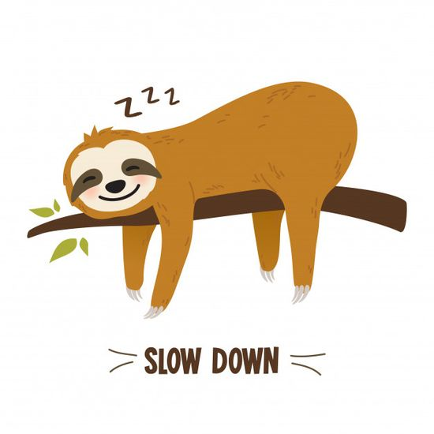

class: center, middle

.linea-superior[]
.linea-inferior[]


## Capacitación en R y herramientas de productividad - Bases de datos

## Proyecto Estratégico Metodologías y Ciencia de Datos para la Producción Estadística

### Abril 2023

```{r setup, include=FALSE}
options(htmltools.dir.version = TRUE)
knitr::opts_chunk$set(message = FALSE, warning = F, eval = T) 
options(scipen = "999")
```

```{r xaringan-themer, include=FALSE, warning=FALSE}
library(xaringanthemer)
```

---

background-image: url("imagenes/fondo2.PNG")
background-size: contain;
background-position: 100% 0%


# Estructura del taller

**Contenidos de la clase**

- Motivación

--

- Breve comentario sobre bases de datos

--

- Conexión a una base de datos desde R

--

- Consultas a una base de datos

--

- Construcción de una base de datos

--

- Consultar nuestra propia base de datos


**Objetivos de la clase:**

- Habilitar a los participantes para trabajar con bases de datos desde R


---

class: inverse, center, middle

# I. Introducción 

---
background-image: url("imagenes/fondo2.PNG")
background-size: contain;
background-position: 100% 0%

# ¿Por qué es relevante trabajar con BBDD?

### Muchos datos viven en lugares diferentes a nuestros computadores 

.center[


]

--

### Como analistas, debemos ser capaces de trabajar con esos datos

---

background-image: url("imagenes/fondo2.PNG")
background-size: contain;
background-position: 100% 0%

# ¿Qué es una base de datos?


.center[


]


--

### Nos centraremos en el mundo SQL (bases de datos relacionales)

--

Si quieres saber más sobre el mundo NoSql, puedes partir por [wikipedia](https://es.wikipedia.org/wiki/NoSQL) 

---


background-image: url("imagenes/fondo2.PNG")
background-size: contain;
background-position: 100% 0%

# ¿Qué es una base de datos relacional?

Colección de tablas relacionadas por un campo común (key)

--

Un archivo csv **NO** es una base de datos  

--

**Las tablas se parecen a los dataframes**

- Colecciones de columnas con datos del mismo tipo

--

**Diferencias**

- Las tablas no viven en memoria

- Los *dataframe* no tienen índices (*data.table* sí tiene)


---


background-image: url("imagenes/fondo2.PNG")
background-size: contain;
background-position: 100% 0%

# Algunas bases de datos populares


.center[


]

### Tienen diferencias, pero todas utilizan SQL

### [Aquí](https://en.wikipedia.org/wiki/List_of_relational_database_management_systems) puedes encontrar aún más bases de datos


--

<br>

.center[

### Mucho blabla ¡Veamos un poco de código!
]


---

class: inverse, center, middle

# II. Conexión a una base de datos 


---


background-image: url("imagenes/fondo2.PNG")
background-size: contain;
background-position: 100% 0%

# Conexión a una base de datos

Vamos a conectarnos a una base que contiene datos de la ENE para varios trimestres

```{r}
library(DBI)
library(dplyr)
```

```{r}
conn <-  DBI::dbConnect(
  drv =  RMariaDB::MariaDB(),
  dbname = "ine", # nombre de la base de datos
  host =   "143.198.79.143" , # IP del servidor
  port =   1111, # puerto
  password = "roscalata", #  pass
  user = "reader" #  solo permiso de lectura
)

```


.center[


]

--

### IMPORTANTE: Estamos en un servidor de prueba. Por favor, no sobrecargar 

---

background-image: url("imagenes/fondo2.PNG")
background-size: contain;
background-position: 100% 0%

# Conexión a una base de datos

.center[


]

### El parámetro driver corresponde a la base de datos que estamos usando

---

background-image: url("imagenes/fondo2.PNG")
background-size: contain;
background-position: 100% 0%

# Consultas simples con DBI

Listemos las tablas dentro de la base de datos

```{r}
DBI::dbListTables(conn)
```

--

Veamos el nombre de las columnas dentro de ene

```{r}
columns <- DBI::dbListFields(conn, "ene")
columns
```

--

Podemos leer la tabla completa, sin embargo, no siempre es buena idea

```{r, eval=FALSE}
table_ene <-  DBI::dbReadTable(conn, "ene")
```

--

### La tabla puede ser demasiado grande y no entrar en la memoria


---

background-image: url("imagenes/fondo2.PNG")
background-size: contain;
background-position: 100% 0%

# Consultas simples con SQL

Contemos el número de filas que tiene la tabla

```{r}
sql_output_df <- dbGetQuery(conn, "SELECT COUNT(*) AS `contar` FROM `ene`")
sql_output_df
```


Podemos ver que la tabla contiene `r as.character(sql_output_df$contar[1])`

No es tan buena idea pedir la tabla completa

--

Noten que `dbGetQuery` devuelve un data.frame con el resultado de la consulta 👀 


---
background-image: url("imagenes/fondo2.PNG")
background-size: contain;
background-position: 100% 0%

# Consultas por lotes

`dbSendQuery` envía la consulta sin hacer fetch

```{r}
sql_query <- dbSendQuery(conn, "SELECT COUNT(*) AS `contar` FROM `ene`")
sql_query
```
--

Podemos hacer consultas por "lotes"

```{r}
sql_query <- dbSendQuery(conn, "SELECT sexo, edad FROM `ene`")
output1 <- dbFetch(sql_query, 10) 
DBI::dbHasCompleted(sql_query) 
output2 <- dbFetch(sql_query, 10) 
DBI::dbHasCompleted(sql_query) 
output3 <- dbFetch(sql_query, 94023) 
DBI::dbHasCompleted(sql_query) 

```
---
background-image: url("imagenes/fondo2.PNG")
background-size: contain;
background-position: 100% 0%

# Consultas por lotes

```{r}
sql_query <- dbSendQuery(conn, "SELECT sexo, edad FROM `ene`")
```


```{r}
count <- 0
while (DBI::dbHasCompleted(sql_query) == FALSE ) {
  output <- dbFetch(sql_query, 20000) 
  count <- count + 1
  print(count)
}

```
Con esta estrategia podemos procesar información de manera fragmentada, incluso en una máquina pequeña 😎  

--

.center[
### ¿Es imprescindible aprender SQL para trabajar con una base de datos?
]


---
background-image: url("imagenes/fondo2.PNG")
background-size: contain;
background-position: 100% 0%

# dplyr al rescate

.pull-left[

]


.pull-right[

```{r}
connection <- tbl(conn, "ene")

connection %>% 
  summarise(freq = n()) 
```

]

--

Con `show_query` podemos ver la traducción a SQL

```{r}
connection %>% 
  summarise(freq = n()) %>% 
  show_query()

```

---

background-image: url("imagenes/fondo2.PNG")
background-size: contain;
background-position: 100% 0%

# Funcionamiento dbplyr 

.pull-left[

```{r}
library(tictoc)
tic()
output <-  connection %>% 
  filter(edad <= 25) %>% 
  group_by(sexo) %>% 
  summarise(freq = n()) 
toc()
```

]

.pull-right[

```{r}

tic()
connection %>% 
  filter(edad <= 25) %>% 
  group_by(sexo) %>% 
  summarise(freq = n()) 
toc()


```

]

--

### ¿Alguien tiene una idea de por qué el tiempo de ejecución es distinto?

--

.center[

]


---

background-image: url("imagenes/fondo2.PNG")
background-size: contain;
background-position: 100% 0%

# Evaluación lazy 

La consulta funciona por detrás con `dbplyr` 

`dbplyr` intenta retrasar la evaluación lo que más pueda 

--

El objeto `output` no es un `dataframe`, sino una conexión a la base de datos

```{r}
class(output)
```

--

Con `collect` podemos traer la información desde la base de datos 

```{r}
output %>%
  collect() %>% 
  class()
```

--

### Recuerda que el procesamiento se ejecuta en el servidor

El resultado de la consulta no necesariamente entrará en tu memoria

---

class: inverse, center, middle

# III. Creando nuestra propia base de datos 


---
background-image: url("imagenes/fondo2.PNG")
background-size: contain;
background-position: 100% 0%

# Construyendo nuestra propia base de datos 

Hasta el momento hemos consultado una base de datos

--

Estamos usando un usuario que solo tiene permisos de lectura

```{r, error=TRUE}
df <- data.frame(var1 = c(1:3), var2 = 4:6)
DBI::dbCreateTable(conn, "ene2", df)
```
--

```{r, error=TRUE}
DBI::dbRemoveTable(conn, "ene")

```


--

### Vamos a crear nuestra propia base de datos y prender fuego a todo


.center[

]


---


---
background-image: url("imagenes/fondo2.PNG")
background-size: contain;
background-position: 100% 0%

# Otros temas 


Despliegue de una bases de datos desde un contenedor (MariaDB, MySQL o PostgreSQL)

.center[

]

--

Exponer una base de datos a terceros 

.center[


]

--

Cómo crear un servidor linux con Digital Ocean

.pull-left[

]

.pull-left[

]

---

class: center, middle

.linea-superior[]
.linea-inferior[]


## Capacitación en R y herramientas de productividad - bases de datos

## Proyecto Estratégico Metodologías y Ciencia de Datos para la Producción Estadística

### Abril 2023
